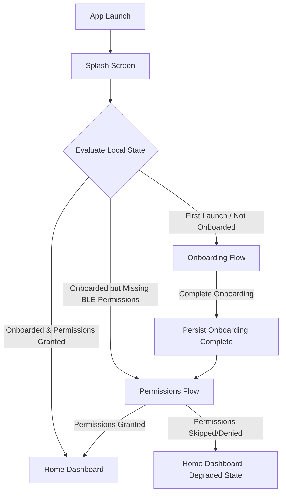
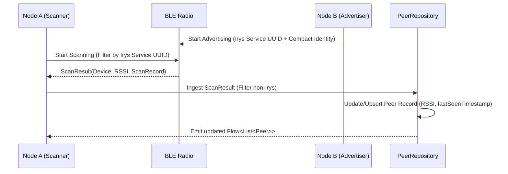
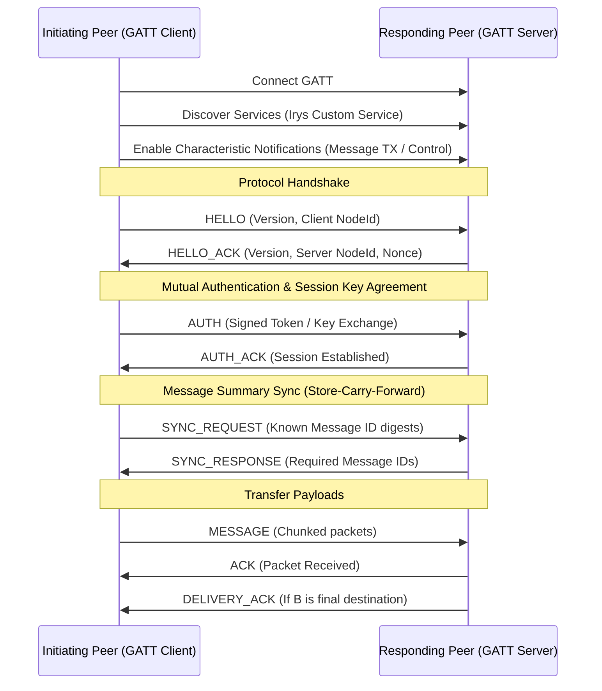
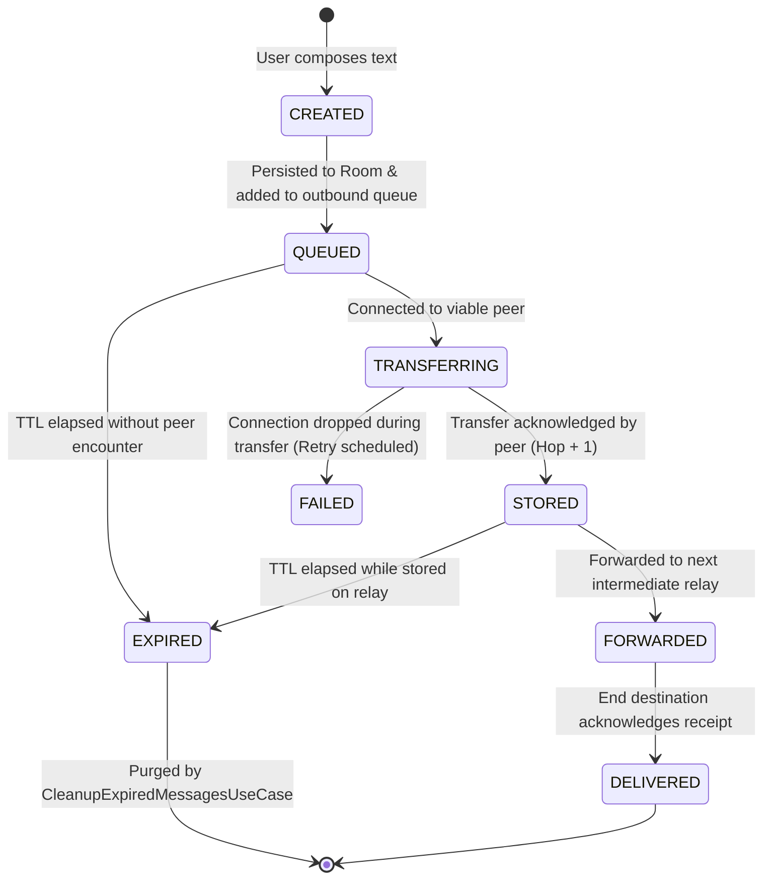
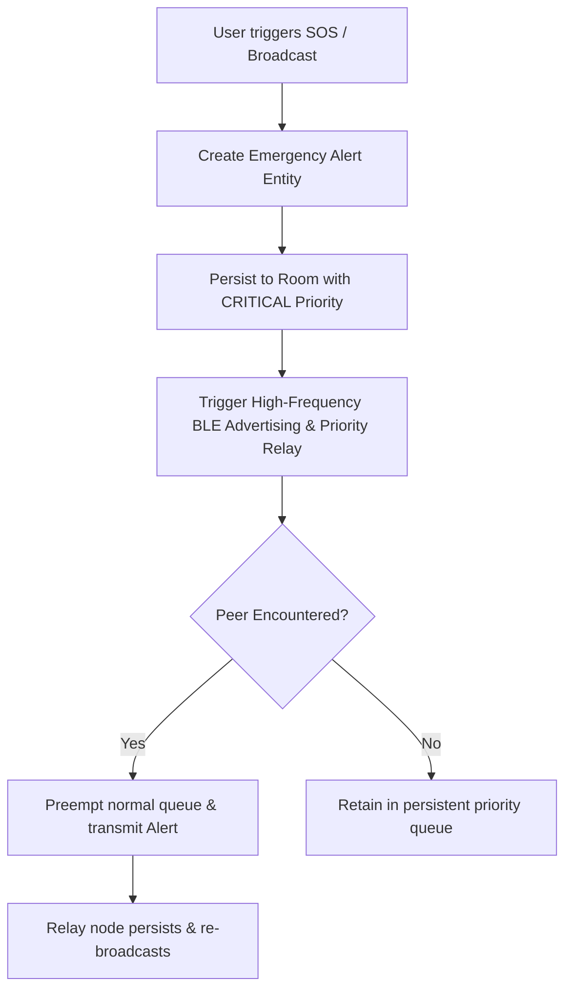

# Irys — Application and System Flow Specification

**Document Purpose:** Authoritative definition of user journeys, screen transitions, protocol sequences, and background data flows for Irys.

---

## 1. Application Launch and Lifecycle Flow



### 1.1 Splash Screen Sequence
1. **Initialize Core Modules**: Load Hilt graph, initialize Room database (`IrysDatabase`), bind dispatchers.
2. **Read Persistent Flags**: Query `AppSettingDao` for `onboarding_completed` and cryptographic identity existence.
3. **Inspect Runtime Permissions**: Check `BLUETOOTH_SCAN`, `BLUETOOTH_CONNECT`, `BLUETOOTH_ADVERTISE` (Android 12+) or `ACCESS_FINE_LOCATION` (Android 11 and below).
4. **Route Selection**:
   - `Routes.ONBOARDING` if onboarding flag is false.
   - `Routes.PERMISSIONS` if required permissions are missing.
   - `Routes.HOME` if ready.

---

## 2. Navigation Architecture

```mermaid
flowchart LR
    Splash[Splash] --> Onboarding[Onboarding]
    Splash --> Permissions[Permissions]
    Splash --> MainGraph[Main App Container]
    
    subgraph BottomNav[Top-Level Bottom Navigation]
        Home[Home Dashboard]
        Nearby[Nearby Peers]
        Chats[Chats]
        Emergency[Emergency Hub]
        Settings[Settings]
    end
    
    MainGraph --> BottomNav
    
    Chats --> ChatDetail[Chat Screen /chat/{conversationId}]
    Emergency --> EmergencyDetail[Alert Detail /emergency/{alertId}]
    Home --> Profile[Profile /profile]
```

### 2.1 Route Definitions
- `Routes.SPLASH` (`"splash"`): Entry initialization point.
- `Routes.ONBOARDING` (`"onboarding"`): Offline-first mesh communication explainer and setup.
- `Routes.PERMISSIONS` (`"permissions"`): Explicit Bluetooth & location permission justification and request.
- `Routes.HOME` (`"home"`): High-level operational overview, network health, quick actions.
- `Routes.NEARBY` (`"nearby"`): Active scanner and discovered peer list.
- `Routes.CHATS` (`"chats"`): Offline conversation list and delivery states.
- `Routes.CHAT_DETAIL` (`"chat/{conversationId}"`): Message history and interactive peer messaging.
- `Routes.EMERGENCY` (`"emergency"`): High-priority broadcast center (SOS, alerts).
- `Routes.EMERGENCY_DETAIL` (`"emergency/{alertId}"`): Full emergency advisory inspection.
- `Routes.PROFILE` (`"profile"`): Node identity, public key fingerprint, node alias.
- `Routes.SETTINGS` (`"settings"`): Battery optimization, radio behavior, data cleanup.

---

## 3. Peer Discovery Flow (Phase 3+)



---

## 4. Connection, Handshake & Synchronization Flow (Phase 4-6)



---

## 5. Message Lifecycle & Store-Carry-Forward Flow (Phase 5-6)



---

## 6. Emergency Broadcast Flow (Phase 8)


